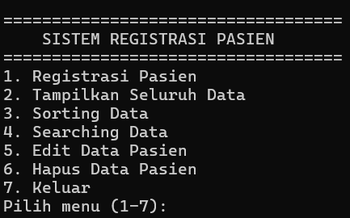
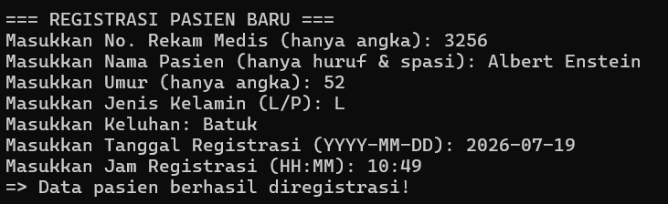
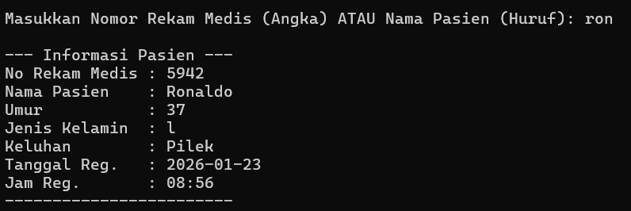
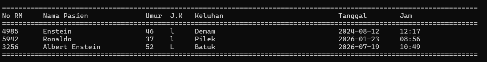
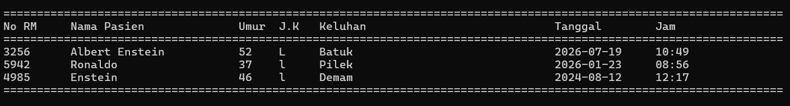

# Patient Registration System

A console-based patient registration system built in **C++** as a Data Structures course project.

This project demonstrates how fundamental data structures and algorithms can be applied to a simple record-management use case. Users can register, view, search, sort, edit, and delete patient records through a menu-driven console interface.

## Features

- Register new patient records
- Display all registered patients
- Search by medical record number or patient name
- Sort records by registration date and time
  - Oldest to newest
  - Newest to oldest
- Edit existing patient information
- Delete patient records
- Prevent duplicate medical record numbers
- Validate numeric, name, date-format, and time-format input
- Handle up to 100 patient records in memory

## Concepts Implemented

| Concept | Implementation |
| --- | --- |
| `struct` | Represents a patient record |
| Array | Stores up to 100 patient records |
| Functions | Separates validation, input, search, sorting, and CRUD operations |
| Sequential Search | Finds records by medical record number or partial patient name |
| Bubble Sort | Orders records by registration date and time |
| String Manipulation | Supports case-insensitive partial-name search |
| Input Validation | Rejects invalid formats and duplicate medical record numbers |

## Project Structure

```text
SistemRegistrasiPasien/
├── assets/
│   └── screenshots/
│       ├── ascending.png
│       ├── descending.png
│       ├── menu.png
│       ├── registrasi.png
│       └── searching.png
├── src/
│   └── main.cpp
├── .gitignore
└── README.md
```

## Screenshots

### Main Menu



### Patient Registration



### Search



### Ascending Sort



### Descending Sort



## Getting Started

### Requirements

- A C++ compiler such as GCC / MinGW
- Terminal, Command Prompt, or a C++ IDE

### Compile

From the repository root:

```bash
g++ src/main.cpp -o patient-registration
```

### Run

**Windows**

```bash
patient-registration.exe
```

**Linux / macOS**

```bash
./patient-registration
```

## What I Learned

Through this project, I practiced:

- Translating requirements into program logic
- Modeling related data with a C++ `struct`
- Managing records with arrays
- Breaking a program into reusable functions
- Implementing sequential search and bubble sort manually
- Performing case-insensitive string search
- Validating console input
- Organizing source code with Git and GitHub

## Possible Improvements

Future improvements could include:

- Persisting records to a file or database
- Replacing the fixed-size array with a dynamic container
- Refactoring the program using object-oriented programming
- Validating real calendar dates and 24-hour time ranges
- Adding automated tests
- Building a graphical or web-based interface

## Project Context

This project was developed for a **Data Structures course** to practice fundamental C++ programming, searching, sorting, and record-management concepts.

It is an educational project and is **not intended for production healthcare use**.
